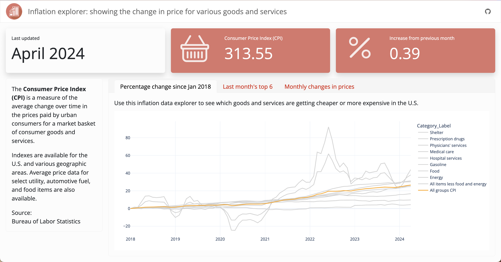
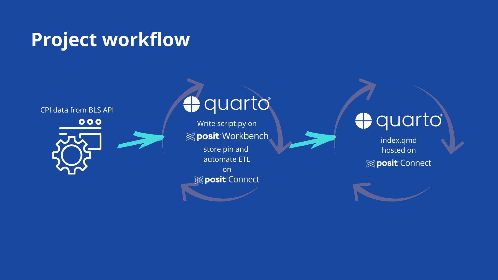

# Inflation Explorer

##  End-to-End Workflow with Posit Team, May 2024

*Automate your reporting with Quarto Dashboards and Posit Connect*

Welcome to the GitHub repository for the project showcased in Posit's "End-to-End Workflow with Posit Team" webinar in May 2024. This project includes a Quarto dashboard that automatically updates monthly with the latest Consumer Price Index (CPI) data from the Bureau of Labor Statistics.



* [Event invite](https://pos.it/team-demo) - *Happening May 29, 2024 at 11am ET*
* [Slides](https://colorado.posit.co/rsc/inflation-explorer-slides/)
    * [GitHub Repo for Slides](https://github.com/ivelasq/automated-quarto-dashboards-slides)
* [File structure](#file-structure)
* [End-to-end workflow](#end-to-end-workflow)
* [Dashboard link](https://colorado.posit.co/rsc/inflation-explorer/)
* [Pin link](https://colorado.posit.co/rsc/connect/#/apps/bed37c0a-b96c-4ede-9ea5-c18368a5c349/access)
* [Python script link](https://colorado.posit.co/rsc/inflation-explorer-python-script/)

## Useful links

### Quarto

* [Quarto website](https://quarto.org/)
* [Quarto dashboards](https://quarto.org/docs/dashboards/)
* [Quarto dashboard gallery](https://quarto.org/docs/dashboards/examples/)

### Posit professional products

* [Posit Team](https://posit.co/products/enterprise/team/)
* [Publishing Python content on Posit Connect](https://docs.posit.co/connect/user/publishing-cli/)
* [Scheduling on Posit Connect](https://docs.posit.co/connect/user/scheduling/)

### Additional packages

* [bslib](https://rstudio.github.io/bslib/)
* [Great Tables](https://github.com/posit-dev/great-tables)
* [pins](https://rstudio.github.io/pins-python/get_started.html)

### Additional links

* [End-to-end workflows with Posit Team playlist](https://www.youtube.com/playlist?list=PL9HYL-VRX0oRsUB5AgNMQuKuHPpNDLBVt)
* [Bureau of Labor Statistics -- Consumer Price Index](https://www.bls.gov/cpi)
* [posit::conf(2024)](https://posit.co/conference)

## File structure

```
├── images
│   └── logo.png            # Logo image to use in the dashboard
├── .gitignore              # Files and folders to ignore when pushing up changes
├── README.md               # Project overview and setup instructions
├── _publish.yml            # File for specifying the publishing destination
├── _quarto.yml             # Quarto project configuration file
├── all_data_report.json    # JSON version of the downloaded BLS data
├── custom.scss             # Custom Sass file
├── data-pull.qmd           # Quarto document version of the ETL script
├── filename.csv            # CSV version of the downloaded BLS data
├── index.qmd               # Quarto dashboard document
├── requirements.txt        # List of dependencies
└── script.py               # Python script version of the ETL script
```

## End-to-end workflow




